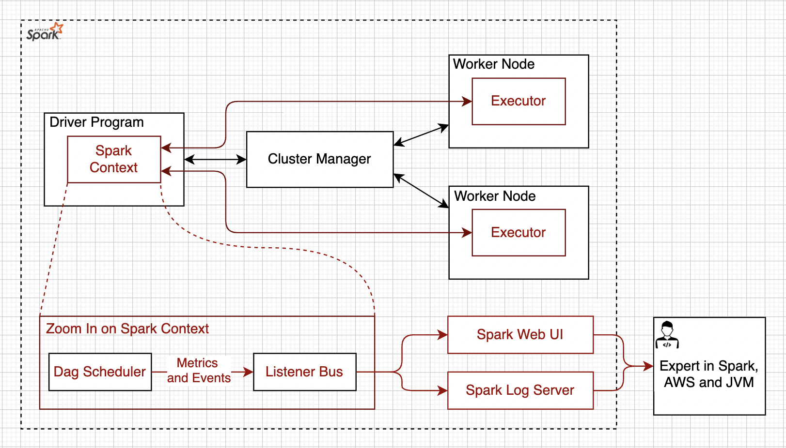

# VISUM 

## Background
Visum is a Cost Optimization Tool for Cloud Native Applications. The first version of this project takes a [bottom up](https://en.wikipedia.org/wiki/Top-down_and_bottom-up_design) approach and focuses on cost optimization of [Apache Spark](https://spark.apache.org/) Applications that are running on [AWS](https://en.wikipedia.org/wiki/Amazon_Web_Services/). However, an Apache Spark Application is a private case of Cloud Native Applications. Later, Visum can be extended to handle any Cloud Native Application.

### Apache Spark
[Apache Spark](https://spark.apache.org/) is an open-source unified analytics engine for large-scale data processing. Spark provides an interface for programming clusters with implicit data parallelism and fault tolerance.

<table width="256px">
  <tr>
    <td></td>
  </tr>
  <tr><td align="center">Apache Spark</td></tr>
</table>  

### Apache Spark Applications on Cloud
[ESG research](https://aws.amazon.com/big-data/what-is-spark/) found that 43% of respondents considering cloud as their primary deployment for Apache Spark. And it makes a lot of sense because the cloud provides scalability, reliability, availability, and massive economies of scale. Another strong selling point of cloud deployment is a low barrier of entry in the form of managed services. Each one of the [Big 3](https://www.itprotoday.com/iaas-and-paas/big-3-public-cloud-providers-continue-dominate-led-aws) cloud providers comes with its own offering to run Apache Spark as a managed service. 

### Apache Spark Applications and Cloud Costs
Running high scale Apache Spark Application on Public Clouds is expensive. For example, when running on [AWS EMR](https://aws.amazon.com/emr/pricing/) applications are billed for execution time * number of cores * price/core/minute + cost of storage + managed service fee. And the question is how do we know that execution time of Apache Spark Application is optimal?
There are a lot of things that can potentially go wrong: executors can fail, the latency to external data sources can increase, the performance can degrade because of changes in the nature of the input data or because of code changes, and many more. In order to address all these potential issues, it is necessary to proactively monitor the important metrics in real-time. 

### Apache Spark Applications and Costs Monitoring
Spark Applications use a dynamic allocation policy, meaning that applications during the runtime may request resources when there is a demand and give resources back to the cluster if they are no longer used. Some applications will do such an allocate/release cycle a couple of times during the runtime. Spark Listeners and Spark UI can help with cost tracking and observability. The following [article](https://itnext.io/processing-costs-measurement-on-multi-tenant-emr-clusters-be09a2e021ca) shows how [Spark Listeners](https://spark.apache.org/docs/latest/api/java/index.html?org/apache/spark/scheduler/SparkListener.html) and [Spark UI](https://spark.apache.org/docs/latest/web-ui.html) can be used for observability and tracking cloud costs.
<table width="256px">
  <tr>
    <td></td>
  </tr>
  <tr><td align="center">Monitoring Apache Spark Jobs</td></tr>
</table>

Performing performance tuning and cost optimization of Apache Spark is a hard task. There are a lot of things that can potentially go wrong: executors can fail. latency to external data sources can increase, the performance can degrade because of changes in the nature of the input data, wrong usage of cloud APIs, and many more. 

## Problem Statement

