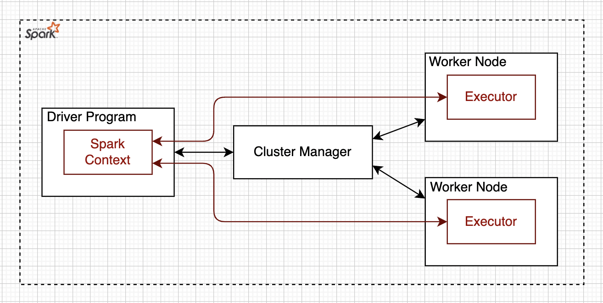

# VISUM 

## Background
Visum is a Cost Optimization Tool for Cloud Native Applications. The first version of this project takes a [bottom up](https://en.wikipedia.org/wiki/Top-down_and_bottom-up_design) approach and focuses on cost optimization of [Apache Spark](https://spark.apache.org/) Applications that are running on [AWS](https://en.wikipedia.org/wiki/Amazon_Web_Services/). However, an Apache Spark Application is a private case of Cloud Native Applications. Later, Visum can be extended to handle any Cloud Native Application.

### Apache Spark
[Apache Spark](https://spark.apache.org/) is an open-source unified analytics engine for large-scale data processing. Spark provides an interface for programming clusters with implicit data parallelism and fault tolerance.

<table width="256px">
  <tr>
    <td></td>
  </tr>
  <tr><td align="center">Apache Spark</td></tr>
</table>  

### Apache Spark Applications on AWS
[ESG research](https://aws.amazon.com/big-data/what-is-spark/) found that 43% of respondents considering cloud as their primary deployment for Apache Spark. And it makes a lot of sense because the cloud provides scalability, reliability, availability, and massive economies of scale. Another strong selling point of cloud deployment is a low barrier of entry in the form of managed services. Each one of the [Big 3](https://www.itprotoday.com/iaas-and-paas/big-3-public-cloud-providers-continue-dominate-led-aws) cloud providers comes with its own offering to run Apache Spark as a managed service. 

### Apache Spark Applications and Cloud Costs

