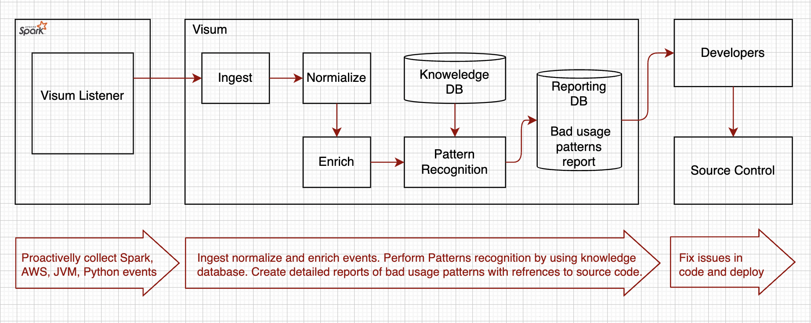
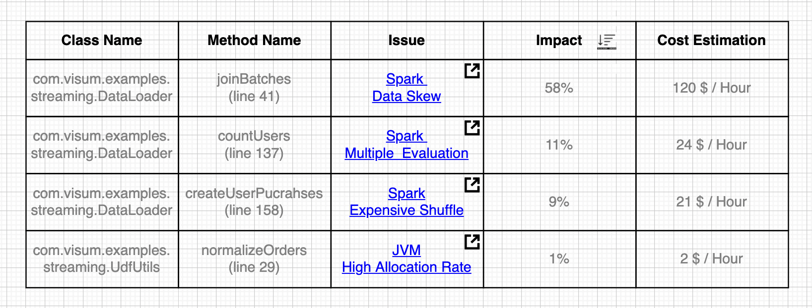
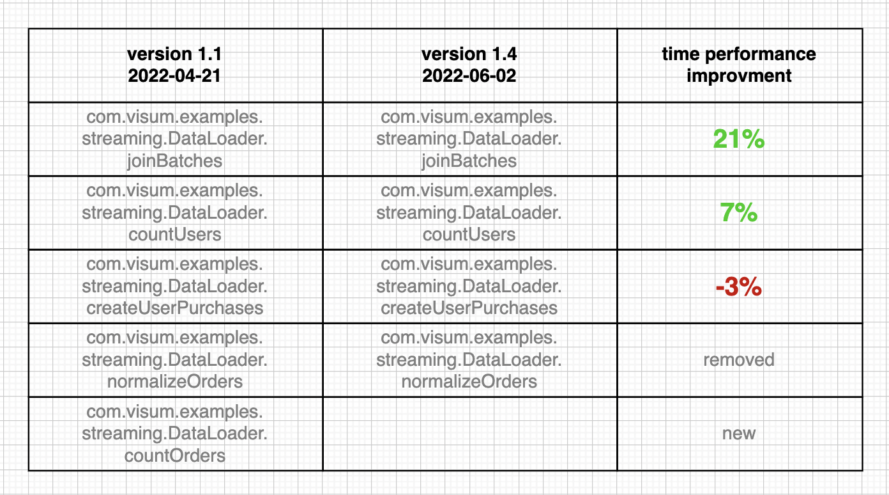

# Visum - A Cloud Cost Optimization Platform

## Background
Visum is a Cost Optimization Platform for Cloud Native Applications. The first version of Visum takes a [bottom up](https://en.wikipedia.org/wiki/Top-down_and_bottom-up_design) approach and focuses on cost optimization of [Apache Spark](https://spark.apache.org/) Applications that are running on [AWS](https://en.wikipedia.org/wiki/Amazon_Web_Services/). However, Apache Spark Applications are a private case of Cloud Native Applications. Later, Visum can be extended to handle any Cloud Native Application.

### Apache Spark
[Apache Spark](https://spark.apache.org/) is an open-source unified analytics engine for large-scale data processing. Spark provides an interface for programming clusters with implicit data parallelism and fault tolerance.

<table width="256px">
  <tr>
    <td></td>
  </tr>
  <tr><td align="center">Apache Spark</td></tr>
</table>  

### Apache Spark Applications on Cloud
[ESG research](https://aws.amazon.com/big-data/what-is-spark/) found that 43% of respondents considering cloud as their primary deployment for Apache Spark. And it makes a lot of sense because the cloud provides scalability, reliability, availability, and massive economies of scale. Another strong selling point of cloud deployment is a low barrier of entry in the form of managed services. Each one of the [Big 3](https://www.itprotoday.com/iaas-and-paas/big-3-public-cloud-providers-continue-dominate-led-aws) cloud providers comes with its own offering to run Apache Spark as a managed service. 

### Apache Spark Applications and Cloud Costs
Running high scale Apache Spark Application on Public Clouds is expensive. For example, when running on [AWS EMR](https://aws.amazon.com/emr/pricing/) applications are billed for execution time * number of cores * price/core/minute + cost of storage + managed service fee. Data Processing of 1 TB of daily traffic can be as expensive as [1M USD / year](https://medium.com/itnext/migrating-apache-spark-workloads-from-aws-emr-to-kubernetes-463742b49fda). In such a scenario, any problem or bad code change that adds 10% to the execution time, will cost additional 100K USD/year. So, the intensive of keeping costs under control is very high.

### Apache Spark Applications and Costs Monitoring
Spark Applications use a dynamic allocation policy, meaning that applications during the runtime may request resources when there is a demand and give resources back to the cluster if they are no longer used. Some applications will do such an allocate/release cycle a couple of times during the runtime. Spark Listeners and Spark UI can help with cost tracking and observability. The following [article](https://itnext.io/processing-costs-measurement-on-multi-tenant-emr-clusters-be09a2e021ca) shows how [Spark Listeners](https://spark.apache.org/docs/latest/api/java/index.html?org/apache/spark/scheduler/SparkListener.html) and [Spark UI](https://spark.apache.org/docs/latest/web-ui.html) can be used for observability and tracking cloud costs.
<table width="256px">
  <tr>
    <td></td>
  </tr>
  <tr><td align="center">Monitoring Apache Spark Jobs</td></tr>
</table>

### Costs Monitoring and Optimization
Performing cost optimization of Apache Spark is a hard task. There are a lot of things that can potentially go wrong: executors can fail, latency to external data sources can increase, the nature of the input data can change, wrong usage of cloud APIs, problems in JVM and many more. One should be a word class expert in all 3 domains: [JVM](https://en.wikipedia.org/wiki/Java_virtual_machine), Apache Spark and Specific Cloud Provider like AWS, [Azure](https://en.wikipedia.org/wiki/Microsoft_Azure), GCP.

## Problem Statement
Essentially there are three problems when dealing with Spark Applications Costs:

1. Reactive way of work. Dev Teams reacts to the past rather than anticipate the future. Cost optimizations process starts only when the cloud cost skyrockets and a lot of money already wasted. In fact, 'small' problems like 10% of additional execution time (can be 100K USD/yearly and more) are never handled at all.

2. The highest level of expertise is required. One should have a deep and comprehensive knowledge in all three domains: Apache Spark, AWS APIs and JVM in order to optimize the cost of Apache Spark Applications. In addition, when working with [PySpark](https://spark.apache.org/docs/latest/api/python/#:~:text=PySpark%20is%20an%20interface%20for,data%20in%20a%20distributed%20environment.) it is necessary to master [Python](https://www.python.org/) as well. It is rare when one person has all these skills.

3. Long time to fix. Even when detected, cost optimization issues are not prioritized for handling. Dev teams work on what is urgent, like designing and developing new features, handling product bugs, etc. Cost Optimization tasks fail into the non-functional tasks bucket. Such tasks are hard to justify without having the exact dollar figure for money waste. And even when prioritized, it takes time to find the problem, perform code fix and deploy to the production.

## Solution
The whole idea of Visum is to find 'bad patterns' automatically. To do so, Visum intercepts events from [Spark scheduler](https://mallikarjuna_g.gitbooks.io/spark/content/spark-SparkListener.html), JVM, AWS, and performs data stream analytics in real time. Visum performs all steps that usually performed by analytics pipelines: ingestion, normalization, enrichment and pattern recognition. 

<table width="256px">
  <tr>
    <td></td>
  </tr>
  <tr><td align="center">Visum Data Flow</td></tr>
</table>

In the final step, Visum generates two reports. The first one is a detailed report of detected issues with estimated wasted cost of each issue, reference to the source code where the issue happened and link to the knowledge base that explains the problem. 

<table width="256px">
  <tr>
    <td></td>
  </tr>
  <tr><td align="center">Visum Waste Report</td></tr>
</table>

The second one is a Benchmark Report. The Benchmark Report contains performance analysis per method. 

<table width="256px">
  <tr>
    <td></td>
  </tr>
  <tr><td align="center">Visum Benchmark Report</td></tr>
</table>

[TBD - High Level Design ](https://github.com/dimastatz/visum)

